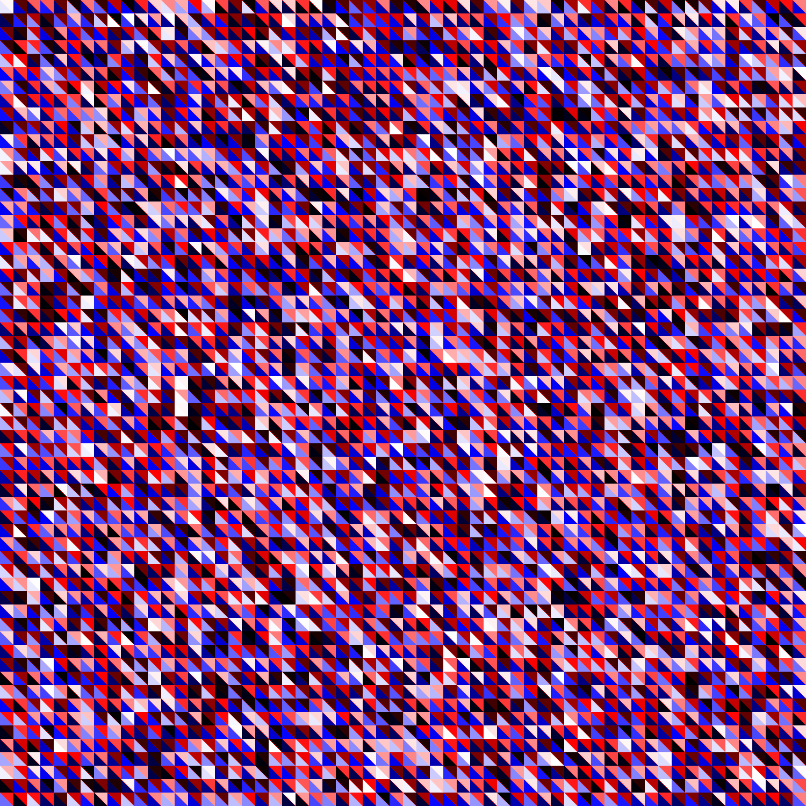

# GeometryMaker

## What is this?
Create a geometric image.
## How to use
1. Install python from [here](https://www.python.org)
   
    (if you are a Japanese user, [this](https://www.python.jp/install/install.html) may serve.)
2. clone this repository
3. run python (if you are using a Windows OS, open the command prompt and type `python geometry.py`)
4. then. image is now available.